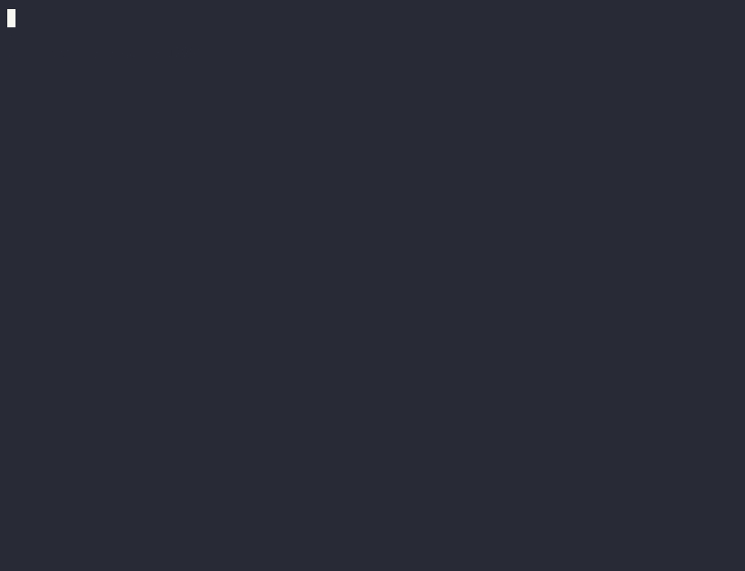

# **[Lockbox]**

**[Lockbox]** is a secure, end-to-end encrypted chat application built with a focus on privacy, ensuring that your conversations are protected from third-party access.

## **Features:**

- End-to-End Encryption (RSA + AES)
- No server-side message reading (Zero Trust Architecture)
- Hardened server setup with SSH keys and HTTPS



## Dependencies

- Latest version of Go (1.23.1 at the moment)

## Instalation

1. Using go install

```bash
go install github.com/m1kkY8/gochat@latest
```

2. From source

```bash
go build && go install
```

## Usage

- gochat -h for help

# Development

## Dependencies

- Docker
- Go
- [Lockbox Relay](https://github.com/m1kkY8/lockbox-relay)
